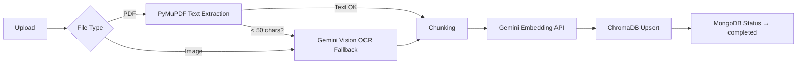
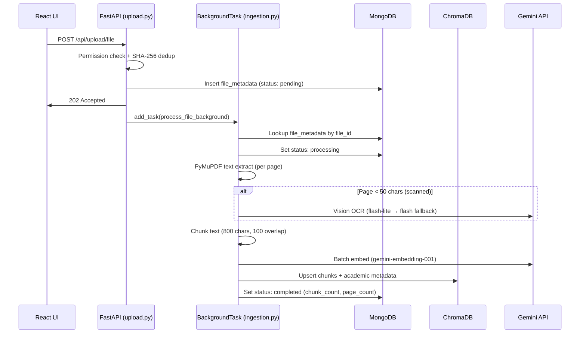

# CampusMind Backend

> Smart Campus AI Knowledge Base — FastAPI · MongoDB · ChromaDB · Gemini AI · JWT Auth

---

## How to Run

```bash
cd backend
uv run uvicorn main:app --reload
```

| Resource | URL |
|---|---|
| Swagger UI | [http://localhost:8000/docs](http://localhost:8000/docs) |
| Health Check | `GET /health` |
| Static Files | `http://localhost:8000/static/pdfs/...` |

---

## 🔐 Authentication

### `POST /api/auth/register`

The `profile` field changes based on `role`:

<details>
<summary><b>👨‍🎓 Student</b> — requires <code>roll_no</code>, <code>branch</code>, <code>year</code></summary>

```json
{
  "email": "jatin.student@tcet.com",
  "name": "Jatin Sharma",
  "password": "secret123",
  "role": "student",
  "profile": {
    "roll_no": "2101",
    "branch": "AI&DS",
    "year": 3
  }
}
```

> `can_upload` is auto-set to `false`. An admin must grant it via `/api/admin/grant-upload`.

</details>

<details>
<summary><b>👨‍🏫 Faculty</b> — requires <code>department</code></summary>

```json
{
  "email": "jatin.faculty@tcet.com",
  "name": "Prof. Jatin Sharma",
  "password": "secret123",
  "role": "faculty",
  "profile": {
    "department": "AI&DS"
  }
}
```

</details>

<details>
<summary><b>🛡️ Admin</b> — requires <code>admin_secret_key</code></summary>

```json
{
  "email": "jatin.admin@tcet.com",
  "name": "Admin Jatin",
  "password": "secret123",
  "role": "admin",
  "admin_secret_key": "TCET_HACK_2026"
}
```

> Without the correct `admin_secret_key` → **403 Forbidden**.

</details>

### `POST /api/auth/login`

Uses `OAuth2PasswordRequestForm` (`username` = email, `password`).

```json
// Response
{ "access_token": "eyJhbG...", "token_type": "bearer" }
```

### `GET /api/users/me`

Returns the authenticated user's full profile. Requires `Authorization: Bearer <token>`.

### 📋 Allowed Enum Values

| Field | Allowed Values |
|---|---|
| `role` | `admin`, `faculty`, `student` |
| `branch` / `department` | `AI&DS`, `COMP`, `IT`, `EXTC`, `MECH`, `CIVIL` |
| `year` | `1`, `2`, `3`, `4` (integers only) |

---

## 🛠️ API Documentation

### Admin Management

> 🔒 **Auth Level:** Admin Only — all endpoints require `role: "admin"` in JWT.

| Method | Endpoint | Description |
|---|---|---|
| `PATCH` | `/api/admin/grant-upload` | Grants upload permission to a student (CR) |
| `PATCH` | `/api/admin/revoke-upload` | Revokes upload permission from a student |
| `GET` | `/api/admin/users` | Lists all users (passwords excluded) |

**Grant / Revoke — Request Body:**

```json
{ "target_user_id": "stu_540d241f85f6" }
```

```json
// Response (200)
{ "message": "Upload permission granted", "user_id": "stu_540d241f85f6" }
```

**List Users — Query Params:**

```
GET /api/admin/users                → all users
GET /api/admin/users?role=student   → students only
GET /api/admin/users?role=faculty   → faculty only
```

```json
// Response (200)
{ "users": [ { "user_id": "...", "email": "...", "role": "...", ... } ], "count": 5 }
```

| Error Case | Status |
|---|---|
| Non-admin JWT | `403` |
| Target user not found | `404` |
| Target is not a student | `400` |

---

### File & Knowledge Base

> 🔒 **Auth Level:** Admin, Faculty, or CR Students (with `can_upload: true`)

#### `POST /api/upload/file`

Multipart file upload with streaming SHA-256 deduplication.

**Form Fields:**

| Field | Type | Required | Description |
|---|---|---|---|
| `file` | `UploadFile` | ✅ | The binary file to upload |
| `year` | `int` | ✅ | Academic year (`1`–`4`) |
| `branch` | `str` | ✅ | Branch enum (`COMP`, `AI&DS`, etc.) |
| `subject` | `str` | ✅ | Free text (e.g., `"Machine Learning"`) |
| `doc_type` | `str` | ✅ | `lecture` · `notes` · `pyq` · `lab` · `reference` |
| `unit` | `int` | ❌ | Unit number (optional) |

**Allowed MIME Types:**

| Role | PDF | Images (PNG/JPEG/WebP) | Video (MP4/WebM) | Audio |
|---|---|---|---|---|
| Admin / Faculty | ✅ | ✅ | ✅ | ❌ |
| CR Student (`can_upload: true`) | ✅ | ✅ | ❌ | ❌ |
| Normal Student | ❌ Upload blocked | ❌ Upload blocked | ❌ | ❌ |

> ⚠️ **Audio files are not supported.** Normal students cannot upload — an admin must first grant `can_upload` via `PATCH /api/admin/grant-upload`.

**Responses:**

```json
// 202 Accepted — new file uploaded
{
  "file_id": "file_cd88e078d7f7...",
  "original_name": "Module 02.pdf",
  "file_type": "pdf",
  "status": "pending",
  "message": "Uploaded. Processing in background."
}
```

```json
// 200 OK — duplicate file detected (same SHA-256 hash)
{
  "file_id": "file_cd88e078d7f7...",
  "message": "File already exists",
  "status": "pending"
}
```

| Error Case | Status |
|---|---|
| Student without `can_upload` | `403` |
| CR student uploading video | `403` |
| Unsupported MIME type | `415` |
| No auth token | `401` |

#### `GET /api/files`

> 🔒 **Auth Level:** Any authenticated user (institute content is visible to all roles)

Lists all institute-wide academic resources with multi-filter support, sorted by newest first.

**Query Parameters (all optional):**

| Param | Type | Example | Description |
|---|---|---|---|
| `year` | `int` | `?year=3` | Academic year (1–4) |
| `branch` | `str` | `?branch=COMP` | Branch filter |
| `subject` | `str` | `?subject=Machine Learning` | Subject name |
| `doc_type` | `str` | `?doc_type=notes` | `lecture` · `notes` · `pyq` · `lab` · `reference` |
| `file_type` | `str` | `?file_type=pdf` | `pdf` · `image` · `video` |

```json
// Response (200)
{
  "files": [
    {
      "file_id": "file_cd88e078d7f7...",
      "original_name": "Module 02.pdf",
      "file_type": "pdf",
      "file_size_bytes": 849220,
      "academic": { "year": 3, "branch": "COMP", "subject": "Machine Learning", "doc_type": "notes" },
      "processing": { "status": "pending", "chunk_count": 0 },
      "uploaded_by": "fac_19664f621900",
      "playback_url": "/static/pdfs/file_cd88e078d7f7.pdf"
    }
  ],
  "count": 1
}
```

> 💡 **`playback_url`** maps directly to the `/static` mount — use it in the frontend to render or link files without building URLs manually.

#### `GET /api/files/{file_id}`

Returns detailed metadata for a single resource by its `file_id`.

```json
// Response (200)
{
  "file_id": "file_b9b2406793d5...",
  "original_name": "download.jpeg",
  "file_type": "image",
  "playback_url": "/static/images/file_b9b2406793d5.jpeg",
  ...
}
```

| Error Case | Status |
|---|---|
| File not found | `404` |
| Visibility is not `institute` | `403` |

> 🔐 **Security:** `storage_path` and `sha256_hash` are **strictly excluded** from all public responses. Only `playback_url` is exposed for file access.

#### 🖥️ Frontend Integration Note

> React **Smart Cards** should use the `playback_url` field from the API response to display or link files:
> - **PDFs** → embed in `<iframe>` or link to `playback_url`
> - **Images** → render with ``
> - **Videos** → play with `<video src={playback_url} />`
>
> The URL is ready to use — just prepend your API base URL (e.g., `http://localhost:8000`) for local dev.

---

## 📁 Storage & Static Serving

```
storage/
├── uploads/
│   ├── pdfs/       ← PDF files
│   ├── images/     ← PNG, JPEG, WebP
│   └── videos/     ← MP4, WebM
└── temp/           ← SHA-256 dedup staging (auto-cleaned)
```

Files are served publicly via the **`/static`** prefix:

```
http://localhost:8000/static/pdfs/file_cd88e078d7f7.pdf
http://localhost:8000/static/images/file_b9b24067.jpeg
http://localhost:8000/static/videos/file_a1c3e5f7.mp4
```

---

## 🧠 Vector Database (ChromaDB)

We use **ChromaDB** in `PersistentClient` mode, stored locally at `./chroma_data/`. No Docker required — data persists across server restarts.

```
chroma_data/              ← auto-created on first startup
└── campus_vectors/       ← single collection, cosine similarity (HNSW)
```

> Initialized in `database/chroma.py` using the same singleton pattern as `mongo.py`. The collection is created in the FastAPI lifespan alongside MongoDB indexes.

---

## ⚙️ Ingestion Pipeline

Every file uploaded via `POST /api/upload/file` triggers a **background ingestion task** (`api/services/ingestion.py`):



| Stage | Tool | Detail |
|---|---|---|
| Text Extraction | **PyMuPDF** (`fitz`) | Page-by-page `get_text()` |
| Vision Fallback | **Gemini 2.5 Flash-Lite** → **Flash** | Scanned/handwritten pages & standalone images |
| Chunking | **LangChain** `RecursiveCharacterTextSplitter` | 800 chars, 100 overlap |
| Embedding | **Gemini Embedding API** (`gemini-embedding-001`) | `RETRIEVAL_DOCUMENT` task type, batched 100 at a time |
| Vector Store | **ChromaDB** `campus_vectors` | Cosine similarity, persistent storage |

**Chunk ID format:** `{file_id}_p{page}_c{chunk}` (e.g., `file_abc123_p2_c3`)

> 🔄 **Model Fallback:** If `gemini-2.5-flash-lite` hits a rate limit (429), the service automatically waits 1 second and retries with `gemini-2.5-flash`.

---

## 🏷️ Metadata Strategy

Every chunk stored in ChromaDB carries **full academic metadata** for scoped RAG searching:

| Metadata Field | Type | Source | Example |
|---|---|---|---|
| `file_id` | `str` | Upload system | `file_cd88e078d7f7` |
| `file_name` | `str` | Original filename | `Module 02.pdf` |
| `file_type` | `str` | Upload detection | `pdf` / `image` |
| `page_number` | `int` | Extraction | `2` |
| `chunk_index` | `int` | Chunking | `3` |
| `year` | `int` | Upload form | `3` |
| `branch` | `str` | Upload form | `COMP` |
| `subject` | `str` | Upload form | `Machine Learning` |
| `doc_type` | `str` | Upload form | `notes` |
| `unit` | `int` | Upload form (optional) | `2` |
| `visibility` | `str` | Server default | `institute` |
| `uploaded_by` | `str` | JWT / MongoDB | `fac_19664f621900` |

> `unit` is only stored when provided — ChromaDB rejects `None` values, so it's omitted if missing.

> This enables **scoped queries** like: *"Find notes about backpropagation in Year 3 COMP Machine Learning"* — the RAG layer can filter by `year`, `branch`, and `subject` before semantic search.

---

## 🚀 Quick Test

**1. Login & get token:**

```bash
curl -X POST http://localhost:8000/api/auth/login \
  -d "username=jatin.faculty@tcet.com&password=secret123" \
  -H "Content-Type: application/x-www-form-urlencoded"
```

**2. Upload a file (triggers background ingestion):**

```bash
curl -X POST http://localhost:8000/api/upload/file \
  -H "Authorization: Bearer <YOUR_JWT_TOKEN>" \
  -F "file=@./test_upload_files/Module 02.pdf" \
  -F "year=3" \
  -F "branch=COMP" \
  -F "subject=Machine Learning" \
  -F "doc_type=notes" \
  -F "unit=2"
# Returns 202 Accepted — ingestion starts in background
```

**3. Wait ~30 seconds, then check status:**

```bash
curl -H "Authorization: Bearer <TOKEN>" http://localhost:8000/api/files
# processing.status should be "completed"
# processing.chunk_count shows total chunks created
```

**4. Verify ChromaDB (Python):**

```python
import chromadb
c = chromadb.PersistentClient(path="./chroma_data")
col = c.get_collection("campus_vectors")
print(f"Total chunks: {col.count()}")
result = col.peek(limit=1)
print(result["metadatas"][0])  # Should show year, branch, subject, etc.
```

**5. Check MongoDB:**

```bash
mongosh
use campus_ai
db.file_metadata.find().pretty()
db.users.find().pretty()
```

**6. Test dedup (re-upload same file):**

```bash
# Same curl as step 2 — should return 200 "File already exists"
```

**7. Test filtering:**

```bash
curl -H "Authorization: Bearer <TOKEN>" "http://localhost:8000/api/files?branch=COMP"    # → 1 file
curl -H "Authorization: Bearer <TOKEN>" "http://localhost:8000/api/files?branch=ECE"     # → 0 files
```

---

## 🔗 Full Upload → Ingest → Search Chain



---

## 🔌 Shared Dependencies

> **Rule:** Single source of truth for all DB connections. Never create separate client instances.

| Module | Exports | Used By |
|---|---|---|
| `database/mongo.py` | `get_db()` → Motor DB instance | `auth.py`, `admin.py`, `upload.py`, `ingestion.py` |
| `database/chroma.py` | `get_chroma_collection()` → campus_vectors | `ingestion.py`, future `nodes.py` (LangGraph) |

---

## 📂 Project Structure

```
backend/
├── main.py                        ← App entry point, lifespan, router mounts
├── .env                           ← MONGO_URI, JWT_SECRET, GEMINI_API_KEY
├── core/
│   ├── config.py                  ← Pydantic settings (env vars)
│   └── security.py                ← JWT encode/decode, password hashing
├── database/
│   ├── mongo.py                   ← Motor async MongoDB singleton
│   └── chroma.py                  ← ChromaDB PersistentClient singleton
├── models/
│   └── schemas.py                 ← Pydantic models & enums
├── api/
│   ├── dependencies.py            ← get_current_user dependency
│   ├── routers/
│   │   ├── auth.py                ← Register, Login, /users/me
│   │   ├── admin.py               ← Grant/revoke upload, list users
│   │   └── upload.py              ← File upload + listing endpoints
│   └── services/
│       └── ingestion.py           ← Background AI ingestion pipeline
├── storage/
│   ├── uploads/{pdfs,images,videos}/
│   └── temp/                      ← SHA-256 dedup staging
└── chroma_data/                   ← Persistent vector DB (auto-created)
```

---

## 📦 Tech Stack

| Component | Technology |
|---|---|
| Framework | FastAPI |
| Database | MongoDB (Motor async driver) |
| Vector DB | ChromaDB (PersistentClient, cosine HNSW) |
| Auth | PyJWT + bcrypt |
| File I/O | aiofiles |
| Text Extraction | PyMuPDF (`fitz`) |
| Vision OCR | Gemini 2.5 Flash-Lite (fallback: Gemini 2.5 Flash) |
| Embeddings | Gemini Embedding API (`gemini-embedding-001`) |
| Chunking | LangChain `RecursiveCharacterTextSplitter` |
| Deps | UV package manager |

---

## ✅ Verified E2E Test Results

| Test | Status |
|---|---|
| Login & JWT | ✅ Pass |
| PDF Upload (202 Accepted) | ✅ Pass |
| Background Ingestion → completed | ✅ Pass (35 chunks, 22 pages) |
| ChromaDB chunks with full metadata | ✅ Pass (year, branch, subject, doc_type, file_type, uploaded_by) |
| Dedup (re-upload same file) | ✅ Pass (200, "File already exists") |
| Filter `?branch=COMP` | ✅ Pass (1 result) |
| Filter `?branch=ECE` | ✅ Pass (0 results) |


## How to operate the chromadb 

```
# Summary (default) — shows all files, chunk counts, pages
uv run python scripts/inspect_chroma.py

# Peek at first N chunks with full text
uv run python scripts/inspect_chroma.py --peek 5

# All chunks for a specific file
uv run python scripts/inspect_chroma.py --file_id 
file_04a24c917017469db1c8fd5384a6f60a

# Text search across all chunks
uv run python scripts/inspect_chroma.py --search "neural network"

# Metadata breakdown (unique years, branches, subjects, etc.)
uv run python scripts/inspect_chroma.py --stats

# Export everything as JSON
uv run python scripts/inspect_chroma.py --export > chunks.json
```