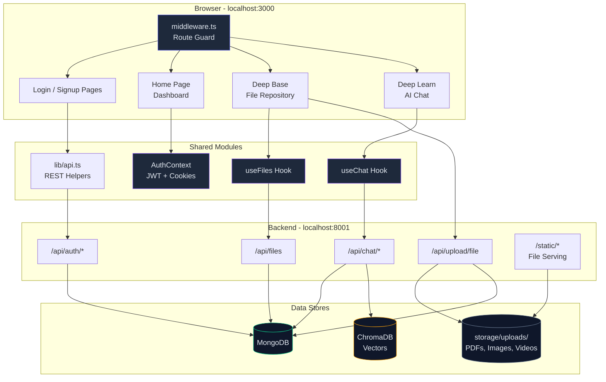
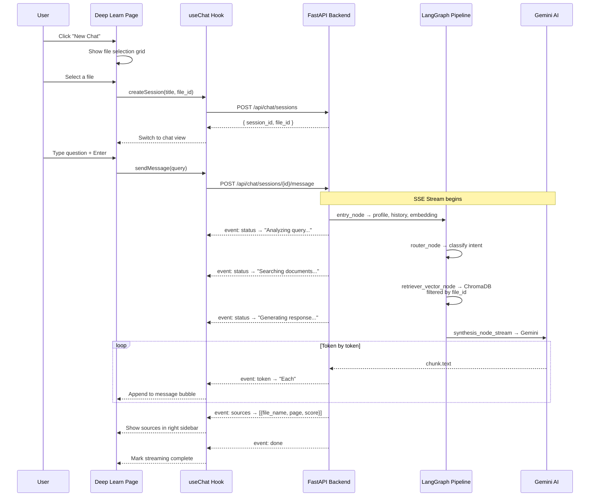

# CampusMind — Frontend

> AI-powered academic knowledge-base interface built with **Next.js 16**, **React 19**, **TypeScript**, **Tailwind CSS 4**, and **Framer Motion**.

---

## Quick Start

```bash
# 1. Install dependencies
npm install

# 2. Start dev server (http://localhost:3000)
npm run dev

# 3. Production build
npm run build && npm start
```

> **Prerequisite:** The FastAPI backend must be running on `http://localhost:8001`. See `../backend/README.md`.

---

## Tech Stack

| Layer        | Technology                                                   |
| ------------ | ------------------------------------------------------------ |
| Framework    | [Next.js 16](https://nextjs.org/) (App Router)              |
| UI           | React 19, TypeScript 5                                       |
| Styling      | Tailwind CSS 4, `clsx`, `tailwind-merge`                     |
| Animations   | [Framer Motion 12](https://www.framer.com/motion/)           |
| Icons        | [Lucide React](https://lucide.dev/)                          |
| 3D           | [Cobe](https://github.com/shuding/cobe) (globe on homepage) |
| Auth         | JWT via cookies (`neural-auth-token`)                        |
| API          | REST calls to FastAPI backend on port 8001                   |
| Streaming    | Server-Sent Events (SSE) for real-time AI chat               |

---

## Architecture Overview



---

## Page Navigation Flow

```mermaid
flowchart LR
    START(("User visits<br/>localhost:3000")) --> MW{"middleware.ts<br/>Has token?"}

    MW -- "No token" --> LOGIN["/login"]
    MW -- "Has token" --> HOME["/"]

    LOGIN -- "Login success" --> HOME
    LOGIN -- "No account" --> SIGNUP["/signup"]
    SIGNUP -- "Register + auto-login" --> HOME

    HOME -- "Header nav" --> DEEPBASE["/deep-base"]
    HOME -- "Header nav" --> DEEPLEARN["/deep-learn"]

    DEEPBASE -- "Upload files" --> DEEPBASE
    DEEPBASE -- "Browse & filter" --> DEEPBASE

    DEEPLEARN -- "New Chat" --> SELECT["Select File"]
    SELECT -- "Pick file" --> CHAT["Chat View"]
    CHAT -- "Back arrow" --> DEEPLEARN
    CHAT -- "Click session" --> CHAT

    style MW fill:#312e81,stroke:#818cf8,color:#e2e8f0
    style LOGIN fill:#1e293b,stroke:#6366f1,color:#e2e8f0
    style SIGNUP fill:#1e293b,stroke:#6366f1,color:#e2e8f0
    style HOME fill:#1e293b,stroke:#6366f1,color:#e2e8f0
    style DEEPBASE fill:#1e293b,stroke:#10b981,color:#e2e8f0
    style DEEPLEARN fill:#1e293b,stroke:#f59e0b,color:#e2e8f0
    style SELECT fill:#1e293b,stroke:#f59e0b,color:#e2e8f0
    style CHAT fill:#1e293b,stroke:#f59e0b,color:#e2e8f0
```



---

## Deep Learn — Chat Data Flow



---

## Project Structure

```
frontend/
├── app/
│   ├── components/        # Shared UI components
│   │   ├── Globe.tsx          # 3D rotating globe (cobe)
│   │   ├── Header.tsx         # Navigation bar with auth-aware links
│   │   ├── HeroSection.tsx    # Landing page hero with tagline
│   │   ├── SemesterSection.tsx# Semester-wise curriculum display
│   │   ├── SubjectCard.tsx    # Individual subject card with units
│   │   └── YearSelector.tsx   # Year tab selector (1st–4th year)
│   │
│   ├── constants/
│   │   └── academic.ts        # Branch, year, subject, doc-type constants
│   │
│   ├── context/
│   │   └── auth-context.tsx   # AuthProvider + useAuth hook (JWT + cookies)
│   │
│   ├── hooks/
│   │   ├── useChat.ts         # Chat session management + SSE streaming
│   │   └── useFiles.ts        # File metadata fetching with academic filters
│   │
│   ├── lib/
│   │   ├── api.ts             # API helper functions (login, signup, profile)
│   │   └── cn.ts              # clsx + tailwind-merge utility
│   │
│   ├── login/
│   │   └── page.tsx           # Login page
│   │
│   ├── signup/
│   │   └── page.tsx           # Signup page (student / faculty / admin)
│   │
│   ├── deep-base/
│   │   └── page.tsx           # File repository: browse, filter, upload files
│   │
│   ├── deep-learn/
│   │   └── page.tsx           # AI chat: file-scoped Q&A with SSE streaming
│   │
│   ├── data.ts                # Hardcoded curriculum data (subjects per year/branch)
│   ├── globals.css            # Global styles + Tailwind directives
│   ├── layout.tsx             # Root layout with AuthProvider
│   ├── page.tsx               # Homepage (hero + year selector + curriculum)
│   └── favicon.ico
│
├── middleware.ts              # Route protection (redirect unauthenticated users)
├── public/                    # Static assets (SVGs)
├── package.json
├── tsconfig.json
├── next.config.ts
├── postcss.config.mjs
└── eslint.config.mjs
```

---

## Pages

### `/` — Home (Dashboard)

The landing page showing:
- **HeroSection** with a 3D globe and tagline
- **YearSelector** tabs (1st–4th Year)
- **SemesterSection** cards showing subjects for the selected year and branch
- Each subject links to its resources via **SubjectCard**

### `/login` — Login

OAuth2 login form. On success, stores JWT in a cookie (`neural-auth-token`, 7-day expiry) and redirects to `/`.

### `/signup` — Register

Multi-role registration form (Student / Faculty / Admin). Admin registration requires a secret key. Auto-logs in after successful registration.

### `/deep-base` — File Repository

Browse, filter, and upload academic files:
- **Filters:** Year, Branch, Subject, Unit, Doc Type, File Type
- **Upload Modal:** Drag-and-drop or click to upload PDFs, images, and videos with academic metadata
- **File Cards:** Show file name, type icon, upload date, processing status, and preview for images
- Files are stored on the backend and processed for vector embeddings

### `/deep-learn` — AI Chat

File-scoped AI Q&A with real-time streaming:
- **Start Screen:** "New Chat" button
- **File Selection:** Choose a processed file to scope the conversation
- **Chat Interface:**
  - Middle panel: message bubbles with token-by-token SSE streaming
  - Left sidebar: previous chat sessions (click to load history)
  - Right sidebar: source references cited by the AI
  - Both sidebars are collapsible via toggle buttons in the header

---

## Key Modules

### `hooks/useChat.ts`

Manages the entire chat lifecycle:

| Function        | Description                                                          |
| --------------- | -------------------------------------------------------------------- |
| `createSession` | `POST /api/chat/sessions` — creates a session, optionally with `file_id` |
| `listSessions`  | `GET /api/chat/sessions` — fetches all user sessions                 |
| `loadHistory`   | `GET /api/chat/sessions/{id}/history` — loads past messages          |
| `sendMessage`   | `POST /api/chat/sessions/{id}/message` — sends query, streams SSE   |
| `stopStreaming`  | Aborts the current SSE stream via `AbortController`                  |

**SSE Event Types** received from the backend:

| Event    | Data      | What it does                                  |
| -------- | --------- | --------------------------------------------- |
| `status` | `string`  | Shows progress ("Analyzing...", "Searching...") |
| `token`  | `string`  | Appends a token to the AI response            |
| `sources`| `array`   | Attaches cited source documents               |
| `done`   | `""`      | Marks stream completion                       |
| `error`  | `string`  | Shows error message                           |

### `hooks/useFiles.ts`

Fetches file metadata from `GET /api/files` with optional filters:
- `year`, `branch`, `subject`, `doc_type`, `file_type`
- Returns `FileMetadata[]` with processing status and academic info
- Auto-refetches when filters change

### `context/auth-context.tsx`

Provides `AuthProvider` and `useAuth()` hook:

| Property/Method | Type                   | Description                              |
| --------------- | ---------------------- | ---------------------------------------- |
| `user`          | `User \| null`         | Current user (profile + JWT token)       |
| `loading`       | `boolean`              | Auth state loading                       |
| `error`         | `string \| null`       | Last auth error                          |
| `login()`       | `async function`       | Login with email + password              |
| `signup()`      | `async function`       | Register + auto-login                    |
| `logout()`      | `function`             | Clear cookie + redirect to `/login`      |

### `lib/api.ts`

Low-level API functions:

| Function        | Endpoint                | Auth   |
| --------------- | ----------------------- | ------ |
| `apiLogin`      | `POST /api/auth/login`  | No     |
| `apiSignup`     | `POST /api/auth/register`| No    |
| `apiGetProfile` | `GET /api/users/me`     | Bearer |
| `apiLogout`     | Client-side only        | —      |

All API calls target `http://localhost:8001/api` (configurable via `API_BASE_URL`).

### `middleware.ts`

Next.js Edge Middleware for route protection:
- **Public routes:** `/login`, `/signup` — accessible without auth
- **Protected routes:** Everything else — redirects to `/login` if no `neural-auth-token` cookie
- **Logged-in redirect:** If user has token and visits `/login` or `/signup`, redirects to `/`

---

## API Integration Map

```
Frontend                          Backend (FastAPI :8001)
────────                          ──────────────────────
Login form       ─────────────►   POST /api/auth/login
Signup form      ─────────────►   POST /api/auth/register
Header avatar    ─────────────►   GET  /api/users/me
Deep Base grid   ─────────────►   GET  /api/files?year=3&branch=COMP
Upload modal     ─────────────►   POST /api/upload/file (multipart)
Deep Learn       ─────────────►   POST /api/chat/sessions
  ├─ sessions    ─────────────►   GET  /api/chat/sessions
  ├─ history     ─────────────►   GET  /api/chat/sessions/{id}/history
  └─ chat (SSE)  ─────────────►   POST /api/chat/sessions/{id}/message
File previews    ─────────────►   GET  http://localhost:8001/static/images/...
```

---

## Environment & Configuration

| Config            | Location                | Value                        |
| ----------------- | ----------------------- | ---------------------------- |
| API Base URL      | `app/lib/api.ts`        | `http://localhost:8001/api`  |
| Auth Cookie Name  | `context/auth-context`  | `neural-auth-token`          |
| Cookie Expiry     | `context/auth-context`  | 7 days                       |
| Dev Server Port   | Next.js default         | `3000`                       |

---

## Available Scripts

| Command          | Description                   |
| ---------------- | ----------------------------- |
| `npm run dev`    | Start dev server with HMR     |
| `npm run build`  | TypeScript check + production build |
| `npm run start`  | Serve production build         |
| `npm run lint`   | Run ESLint                     |

---

## Dependencies

### Production

| Package          | Purpose                                |
| ---------------- | -------------------------------------- |
| `next`           | React meta-framework (App Router)      |
| `react`          | UI library                             |
| `react-dom`      | DOM rendering                          |
| `framer-motion`  | Animations and transitions             |
| `lucide-react`   | Icon library (500+ icons)              |
| `cobe`           | WebGL globe visualization              |
| `clsx`           | Conditional CSS class joining          |
| `tailwind-merge` | Merge conflicting Tailwind classes     |

### Dev

| Package              | Purpose                  |
| -------------------- | ------------------------ |
| `tailwindcss`        | Utility-first CSS        |
| `@tailwindcss/postcss`| PostCSS plugin          |
| `typescript`         | Type checking            |
| `eslint`             | Code linting             |
| `eslint-config-next` | Next.js ESLint rules     |
| `@types/react`       | React type definitions   |
| `@types/node`        | Node.js type definitions |
